# Сайт-портфолио

## Описание доменной области

Этот проект представляет собой сайт-портфолио с личным блогом. Он предназначен для демонстрации проектов, публикации статей и сбора обратной связи через комментарии.

### Выделенные сущности:

*   **User**: Пользователь системы (администратор сайта). Управляет проектами и записями в блоге.
*   **Project**: Проекты, которые отображаются в портфолио. Каждый проект связан с пользователем-автором.
*   **Post**: Записи в блоге. Каждая запись принадлежит определенной категории и имеет автора.
*   **Category**: Категории для записей в блоге (например, "Веб-разработка", "Дизайн"). Помогают структурировать контент.
*   **Comment**: Комментарии к записям в блоге. Позволяют пользователям оставлять отзывы.

## ER-диаграмма

